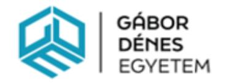
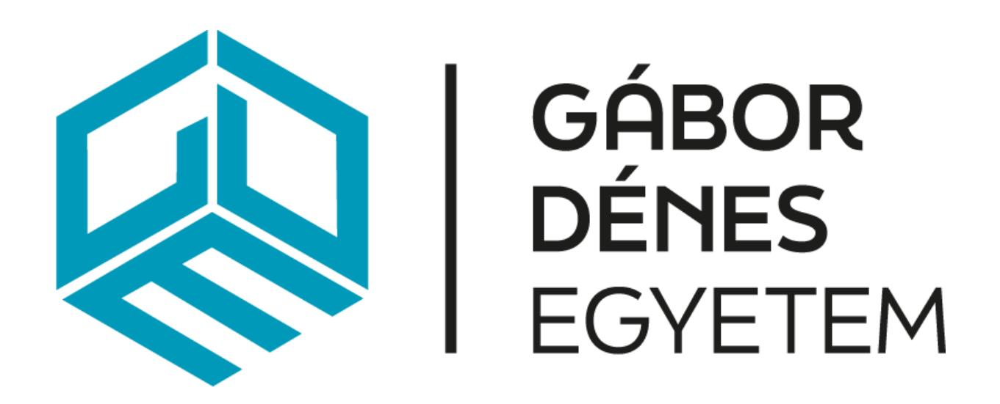

# **Gábor Dénes Egyetem 1119 Budapest, Fejér Lipót utca 70. [info@gde.hu](mailto:info@gde.hu)**

#### **A Gábor Dénes Egyetem rektorának**

**3/2023. (XII.06.) rektori utasítása**

#### **A Gábor Dénes Egyetem Szakdolgozatkészítési Szabályzatának kiadásáról**

A Gábor Dénes Egyetem Szervezeti és Működési Szabályzat 2. § (2) bekezdése alapján kiadom az alábbi utasítást:

# **1. § Az utasítás hatálya**

Az utasítás hatálya kiterjed

- a) az Egyetem valamennyi szervezeti egységére;
- b) az Egyetemmel munkaviszonyban vagy munkavégzésre irányuló egyéb jogviszonyban álló személyekre
- c) az Egyetemmel hallgatói jogviszonyban álló, vagy állt személyekre.

#### **2. § Rendelkező rész**

Jelen utasítás mellékleteként kiadom a Gábor Dénes Egyetem Szakdolgozatkészítési Szabályzatát.

#### **3. § Záró és hatályba léptető rendelkezések**

Jelen utasítás 2023. december 15. napján lép hatályba.

Budapest, 2023. december 6.

# **Szakdolgozatkészítési Szabályzat**

A Szabályzat verziószáma: 2.0 Hatályos: 2023. december 15.-től

| Tartal  | lom                                                 | 3  |
|---------|-----------------------------------------------------|----|
| I. Feje | ezet ÁLTALÁNOS RENDELKEZÉSEK                        | 4  |
| 1.      | § A Szabályzat célja                                | 4  |
| 2.      | § A Szabályzat hatálya                              | 4  |
| 3.      | § Értelmező rendelkezések                           | 4  |
| 4.      | § Jogszabályok                                      | 4  |
| II. FE  | EJEZET A SZAKDOLGOZAT KÉSZÍTÉSÉNEK MENETE           | 5  |
| 5.      | § A szakdolgozat készítés                           | 5  |
| 6.      | § Témaválasztás                                     | 5  |
| 7.      | § Konzulens                                         | 6  |
| 8.      | § Konzultáció                                       | 6  |
| 9.      | § Formai követelmények                              | 6  |
| 10.     | § Hivatkozások, irodalomjegyzék                     | 8  |
| 11.     | § A szakdolgozatok titkosítási eljárása és kezelése | 10 |
| 12.     | § Szakdolgozat beadása                              | 11 |
| 13.     | § Szakdolgozat bírálata                             | 12 |
| 14.     | § Szakdolgozat védése                               | 12 |
| 15.     | § Plágium                                           | 12 |
| III. F  | EJEZET ZÁRÓ RENDELKEZÉSEK                           | 13 |
| 16.     | §                                                   | 13 |
| IV. F   | EJEZET MELLÉKLETEK                                  | 15 |
| 1.      | sz. melléklet - AjánlottTémakörök                   | 15 |
| 2.      | sz. melléklet – Témavázlat                          | 18 |
| 3.      | sz. melléklet –Konzultációs lap                     | 19 |
| 4.      | sz. melléklet –Bírálati lap                         | 20 |
| 5.      | sz. melléklet –Bírálati szempontok                  | 21 |
| 6.      | sz. melléklet – Nyilatkozat(ok)                     | 22 |
| 7.      | sz. melléklet - Címoldal                            | 23 |
| 8.      | sz. melléklet – Titkosítási kérelem                 | 24 |

A Gábor Dénes Egyetem (a továbbiakban: Egyetem) a szakdolgozatkészítés egységes kezelésére az alábbi szabályzatot (továbbiakban: Szabályzat) alkotja.

### **I. Fejezet ÁLTALÁNOS RENDELKEZÉSEK**

# **1. § A Szabályzat célja**

(1) A Szabályzat célja, hogy biztosítsa a szakdolgozatok egységes elvek és folyamat szerinti kezelését.

# **2. § A Szabályzat hatálya**

- (1) A Szabályzat személyi hatálya kiterjed
  - a) az Egyetem valamennyi szervezeti egységére;
  - b) az Egyetemmel munkaviszonyban vagy munkavégzésre irányuló egyéb jogviszonyban álló személyekre (a továbbiakban együtt: foglalkoztatott);
  - c) az Egyetemmel hallgatói jogviszonyban álló vagy állt személyekre (a továbbiakban együtt: Hallgató).
- (2) Az alapképzésben és szakirányú továbbképzésben és a 2017.09.01 előtt hallgatói jogviszonyt létesítő felsőoktatási szakképzésben részt vevők szakdolgozatot, a 2017.09.01-től hallgatói jogviszonyt létesítő felsőoktatási szakképzésben részt vevők záródolgozatot írnak.

# **3. § Értelmező rendelkezések**

- (1) Jelen Szabályzat alkalmazása során:
  - a) **Plágium**: azon cselekedetet, ha valaki egy másik ember (az eredeti szerző) munkáját saját publikált munkájában hivatkozás, forrás megjelölés és/vagy szerzői engedély nélkül felhasználja, azt sajátjaként tünteti fel, és ezzel az eredeti szerző jogait sérti)
  - b) **Szakdolgozat:** A hallgató a felsőoktatási szakképzésben záródolgozatot 2023-tól projektmunkadolgozatot, az alapképzésben és a szakirányú továbbképzésben szakdolgozatot, a mesterképzésben diplomamunkát ír. A továbbiakban egységesen szakdolgozat értendő.

#### **4. § Jogszabályok**

- (1) A szakdolgozatkezelési eljárás során különösen az alábbi jogszabályokat kell alapul venni:
  - a) 2011. évi CCIV törvény a nemzeti felsőoktatásról;
  - b) 1999. évi LXXVI. törvény a szerzői jogról

c) 87/2015. (IV. 9.) Korm. rendelet a nemzeti felsőoktatásról szóló 2011. évi CCIV. törvény egyes rendelkezéseinek végrehajtásáról;

### **II. FEJEZET A SZAKDOLGOZAT KÉSZÍTÉSÉNEK MENETE**

# **5. § A szakdolgozat készítés**

- (1) A szakdolgozat olyan írásbeli dolgozat, amely a szak, szakirány specializáció diszciplínáihoz kapcsolódó elméleti-általános témakört feldolgozó, és/vagy a szakmai gyakorlathoz kapcsolódó, gyakorlati témát elemző önálló munka.
- (2) A hallgató záróvizsgára bocsátásának feltétele szakdolgozat készítése és benyújtása, amelynek védése a záróvizsga részét képezi.
- (3) A szakdolgozat elkészítésének célja az, hogy bemutassa a végzős hallgató (jelölt) készségét a választott téma szakirodalmának igényes feldolgozására, valamint egyetemi tanulmányainak alkalmazására a választott tématerületen és a tématerület szempontjából jellemző gyakorlati példán, vagy olyan elméleti témakörben, amelyben a hallgató az évek során megalapozott ismereteket szerzett.
- (4) A szakdolgozat megvédésének célja annak igazolása, hogy a szakdolgozatot a jelölt maga készítette, és hogy az abban foglalt elméleti, módszertani ismereteket, a jelölt által készített módszertani adaptációkat, elemzéseket, prognózisokat, megállapításokat, javaslatokat diplomás szakembertől elvárható tartalommal és színvonalon képes előadni. A végzett hallgatótól a záróvizsgabizottság elvárja, hogy jó tárgyalókészséggel, magabiztosan mutassa be az egyetemen szerzett szakmai ismereteit és képességét, azok gyakorlati alkalmazását.
- (5) A szakdolgozat elkészítése "fejlesztési" munka, melynek során alkalmazni kell a feladatmegoldás általános, illetve az adott témára specifikus elveit és eszközeit; ez a tanult vagy önállóan megismert módszerek, módszertanok és egyéb eszközök célszerű és indokolt felhasználásában realizálódik.

# **6. § Témaválasztás**

- (1) A szakdolgozat általános témaköreit a szakot gondozó Tanszék adja ki, azok megfelelnek a szak képzési és kimeneti követelményeinek.
- (2) Az 1. sz. melléklet tartalmazza a kiajánlott Szakdolgozati témaköröket.
- (3) A témavázlat két részből tevődik össze, az egyik részben a várható tartalomjegyzék vázlatpontjait, másik részben a szakdolgozat rövid tartalmát, célját kell összefoglalni.
- (4) A témavázlat a választott konzulens jóváhagyását követően adható be.
- (5) A témavázlat formanyomtatványát a 2. sz. melléklet tartalmazza.
- (6) Külső konzulens esetén a végzettségét és az önéletrajzát a témavázlattól külön fájlban "melléklet" megjelöléssel azonos dokumentumban kell csatolni. A témavázlat mellékletét az Egyetem az szakdolgozat védésétkövető 60 napon belül törli a Neptun rendszerből.

- (7) A témaválasztás időszakát a tanév időbeosztás tartalmazza.
- (8) A témaválasztás (témára jelentkezés) menetét a Tanulmányi Központ (a továbbiakban: TK) minden témajelentkezési időszak előtt aktualizálja, és a Neptun bejelentkező képernyőjén a Letölthető dokumentumok között hozza nyilvánosságra.
- (9) Az elfogadott témavázlat az elfogadást követő félév szakdolgozat leadási időszakának végéig érvényes. Amennyiben az elfogadott témavázlatot követően a hallgató nem ad be szakdolgozatot, az elfogadott témavázlat elévül, ebben az esetben a folyamatot előröl kell kezdeni.

# **7. § Konzulens**

- (1) A szakdolgozat készítését konzulens irányítja.
- (2) A konzulens a témában jártas, felsőfokú végzettséggel rendelkező szakember lehet.
- (3) Minden kiadott szakdolgozathoz az Egyetem valamely oktatóját, mint belső konzulenst és/vagy egy külső konzulenst kell kijelölni, illetve felkérni.
- (4) A konzulens megválasztása a hallgató feladata.
- (5) A jelölt választását a tanszékvezető felülbírálhatja a Tanszék oktatóinak leterheltsége és a témaválasztás jellege alapján.
- (6) A hallgató a konzulens útmutatásai alapján dolgozza ki szakdolgozatát, gyűjt és feldolgoz adatokat, szakirodalmakat.
- (7) A konzulens a szakdolgozatot értékeli, és tesz javaslatot az érdemjegyre.
- (8) A hallgató kérheti a konzulens személyének módosítását a Neptun rendszeren keresztül leadott kérelmen keresztül. A konzulensváltási kérelem eljárási díjköteles, a díjat a mindenkori Térítési és Juttatási Szabályzat tartalmazza. A kérelmet az illetékes tanszékvezető bírálja el.

#### **8. § Konzultáció**

- (1) A témavázlat elfogadását követően 30 napon belül fel kell venni a kapcsolatot a konzulenssel, és a konzulenssel való megegyezés alapján kialakítani a szakdolgozat elkészítésének ütemtervét.
- (2) A konzultáció történhet személyesen, telefonon, e-mailben, vagy egyéb platformon. A konzulens a neki leadott "Konzultációs lapon" jegyzi a konzultációk időpontját.
- (3) A konzultációs lap formanyomtatványát a 3. sz. melléklet tartalmazza.
- (4) Amennyiben a hallgatónak felróható okok miatt háromnál kevesebb konzultációra kerül sor, akkor a konzulens megtagadhatja a szakdolgozat beadását.

#### **9. § Formai követelmények**

- (1) A szakdolgozat fő részének minimális terjedelme
  - a) felsőoktatási szakképzésben legalább 10 oldal, és legalább 15.000 karakter szöveg szóközzel együtt.

- b) alapképzésben legalább 40 oldal, és legalább 60.000 karakter szöveg szóközzel együtt.
- c) mesterképzésben legalább 50 oldal, és legalább 75.000 karakter szöveg szóközzel együtt.
- d) szakirányú továbbképzésben legalább 30 oldal, és legalább 40.000 karakter szóközzel együtt.
- (2) A szakdolgozat fő részének maximális terjedelme az előző pontban megadott minimális terjedelem kétszerese.
- (3) A szakdolgozatot a magyar nyelv szabályainak megfelelően világos, érthető stílusban kell megírni.
- (4) A szakkifejezésekre, mértékegységekre, fizikai és matematikai jelölésekre, az ábrák rajzolására a magyar szabvány érvényes előírásai a mérvadók.
- (5) A szakdolgozat formai szerkezete:
  - a) A szakdolgozatot A4-esformátumban kell elkészíteni.
  - b) Az oldaltükör elhelyezési adatai: felül, alul és a külső szélen 25 mm margóbeállítás.
  - c) A sorköz mérete 1,5 sor.
  - d) Igazítás: sorkizárt.
  - e) Lapszámozás alul, lapközépre igazítva.
  - f) Az ábrákat és táblázatokat középre igazítva kell elhelyezni, a címét és a sorszámát az ábra/táblázat felett, a forrásmegjelölését pedig alatta kell elhelyezni középre igazítva.
  - g) A forráskódo(ka)t szöveges formában kell beilleszteni, eltérő háttérrel.
  - h) A folyószöveg betűtípusa Times New Roman, mérete 12 pont.
  - i) A fejezetcímeket (címsorokat) arab számokkal kell számozni, melyek 16 pont méretű karakterekből álljanak, középre igazítva, a lap tetején elhelyezve (Címsor1). Az alfejezetek címeit legfeljebb három szint mélységéig kell számozni, 14 pontos félkövér karakterekkel, középre igazítva (Címsor2, Címsor3).
  - j) Minden első szintű fejezetet (Címsor1) új oldalon kell kezdeni.
- (6) A szakdolgozat felépítése:
  - a) címoldal,
  - b) titkosítási kérelem (ha van),
  - c) tartalomjegyzék,
  - d) szakdolgozat fő része/törzsszövege,
  - e) irodalomjegyzék,
  - f) ábrajegyzék,
  - g) táblázatjegyzék (ha van),
  - h) mellékletek jegyzéke,
  - i) melléklet(ek).
- (7) A szakdolgozat fő része a téma fejezetekre bontott kifejtését tartalmazza. A következő tagolása célszerű:
  - a) Bevezetés: a témaválasztás indoklása,
  - b) A szakdolgozat elméleti és gyakorlati jelentősége, a célkitűzések
  - c) A vizsgálati módszerek/kutatásmódszertan megfogalmazása.
  - d) Az irodalom alapján a lehetséges megközelítési módok és megoldások áttekintése és elemzése (szekunder kutatás).

- e) A megoldási módszer kiválasztása, a választás indoklása.
- f) A részletes specifikáció kidolgozása, leírása.
- g) A tervezés során végzett munkafázisok leírása.
- h) A megvalósítás leírása.
- i) A megvalósítás során levont tanulságok, tapasztalatok ismertetése.
- j) Primer kutatás értékelése.
- k) Hipotézisek vizsgálata.
- l) A megvalósítás elemzése, alkalmazásának és továbbfejlesztési lehetőségeinek számbavétele, javaslatok megfogalmazása, rövid tartalmi összefoglaló.
- (8) Jegyzékek. Irodalomjegyzék, táblázatok és ábrák jegyzéke. Tartalmazza mindazon könyvet, folyóiratot, szakdolgozatot, kéziratot, vállalati dokumentumot, szabványt, internetes és egyéb irodalmat, amelyeket a hallgató a szakdolgozat készítése során részben vagy teljes egészében elolvasott, felhasznált. Ez vonatkozik a szövegközi ábrák, táblázatok, a közölt statisztikai adatok és mellékletek szakirodalmi forrásaira is.
- (9) Mellékletek: azon ábrák, táblázatok, vállalati dokumentumok, kérdőív, interjúvázlat, számítások stb., amelyek a szakdolgozat megértéséhez szükségesek, de formájuk és/vagy terjedelmük miatt indokolt a mellékletben való elhelyezésük, sorszámmal, címmel, forrással ellátva.
- (10) A Nyilatkozat formaszövegét a 6. számú melléklet tartalmazza.
- (11) A szakdolgozathoz tartozó, de külön fájlkét kezelendő állományok:
  - a) témavázlat,
  - b) titkosítási kérelem (ha van),
  - c) konzultációs lap,
  - d) bírálati lap.

# **10. § Hivatkozások, irodalomjegyzék**

- (1) Az irodalomjegyzékben azokat a műveket kell felsorolni, amelyeket a szakdolgozat írója elolvasott és munkája során felhasznált. Ezen szakirodalmi művek száma
  - a) felsőoktatási szakképzésben legalább 5;
  - b) alapképzésben legalább 20,
  - c) mesterképzésben legalább 30,
  - d) szakirányú továbbképzésben legalább 10,
  - minden típusból vegyesen (könyv, konferenciaközlemény, elektronikus forrás, …).
- (2) Az irodalomjegyzék hivatkozási formátuma APA (American Psychological Accossiation) hivatkozástípussal [\(https://apastyle.apa.org/style-grammar-guidelines/references/examples\)](https://apastyle.apa.org/style-grammar-guidelines/references/examples) történik.
- (3) A felhasznált irodalom összeállításában a címek leírásakor alapvető követelmény, hogy a bibliográfiai tételek pontosan és ellenőrizhetően tartalmazzák az adatokat, amelyek alapján a visszakereshetőség biztosítható.
- (4) A nem szó szerinti irodalmi hivatkozások szabálya a szövegben:
  - a) Egy darab irodalom nem szó szerinti hivatkozásánál

- aa) egy mondat esetében azt a mondat végi írásjel előtt kell megtenni. (Például: Ez egy példa mondat egy mondat egy irodalomból történő hivatkozásának bemutatására [1]. )
- ab) egy teljes bekezdés hivatkozása esetén a hivatkozás számát a bekezdés végére kell tenni, a mondatvégi írásjel után. (Például: Mondat1. Mondat2. Ezek egy példa bekezdés mondatai a hivatkozás típus bemutatására. [1]
- b) Több irodalomból történő nem szó szerinti hivatkozásánál az irodalomjegyzékben nem a sorszámban egymást követő irodalmak esetében vesszővel elválasztva kell felsorolni a hivatkozott irodalmakat, ha sorszámban egymást követik, ezesetben kötőjellel elválasztva kell szerepelteti a hivatkozott irodalmakat.
  - ba) egy mondat esetében azt a mondat végi írásjel előtt kell megtenni. (Például: Ez egy példa mondat a hivatkozás típus bemutatására [1-4], [5], [10]. )
  - bb) egy teljes bekezdés hivatkozása esetén a hivatkozás számát a bekezdés végére kell tenni, a mondatvégi írásjel után. (Például: Mondat1. Mondat2. Ezek egy példa bekezdés mondatai a hivatkozás típus bemutatására. [1-4], [5], [10] )
- (5) A szószerinti idézetet minden esetben idézőjelek közé kell tenni, jobbra igazítani és dőlt betűformázással jelölni, továbbá az idézet végére kell tenni a hivatkozást, majd új bekezdésben folytatni a dolgozatot. (Például:

*"Ez egy példa a szószerinti hivatkozás jelölésére." [1] )*

- (6) A szakdolgozatban lévő minden ábrának lennie kell számának és címének, amire hivatkozni kell, amennyiben saját szerkesztésű az ábra, akkor a "saját szerkesztésű ábra" szöveget kell szerepeltetni a forrásmegjelölésben.
- (7) A szakdolgozatban lévő táblázat(ok)nak lennie kell számának és címének, amire hivatkozni kell, amennyiben saját szerkesztésű a táblázat, akkor a "saját szerkesztésű táblázat" szöveget kell szerepeltetni a forrásmegjelölésben.
- (8) A közlemények címét azon a nyelven kell közölni, amelyiken megjelent.
- (9) Folyóiratokban megjelent közlemények esetén:
  - A szerző(k) vezetékneve, a keresztnév első betűje, pont, több szerző esetén gondolatjellel elválasztva, a megjelenés éve zárójelben, kettőspont, szóköz, a cikk címe, pont, folyóirat címe, pont, kötetszám, pont, füzetszám, pont, oldalszám. (Például.: Izsó L. (1982): Az ember-gép rendszerek megbízhatóságának meghatározására szolgáló módszerek áttekintése. Ergonómia, XV. évf. 4. sz., pp. 220-228.)
- (10) Könyvek esetén:
  - A szerző(k) vezetékneve, a keresztnév első betűje, pont, több szerző esetén gondolatjellel elválasztva évszám zárójelben, kettőspont, szóköz, a könyv címe, pont, a kiadó neve, vessző, a megjelenés helye, a könyv terjedelme. (Például: Popp J.–Potori N.–Udovecz G. (2005): Főbb mezőgazdasági ágazatok várható kilátásai az EU csatlakozás után. Szaktudás Kiadó Ház, Budapest, 174 p.ISBN 963955 3 53 0
- (11) Kongresszusok, konferenciák publikált előadásai esetén: A szerző (az előadást tartó) neve, év zárójelben, kettőspont, az előadás címe, a szerző előadásainak oldalszáma (-tól, -ig) In: a kongresszus, konferencia címe/témája/szekciója (ha van ilyen és a kiadvány tartalmazza), a kongresszus, konferencia neve, sorszáma (arab számmal), a kiadványt szerkesztő neve, a kongresszusról kiadott kiadvány címe, kötetszáma, kiadója, a

kiadvány megjelenésének helye, terjedelme (oldalszám vagy CD kiadvány) és ISBN száma (ha van), a kongresszust rendező (szerv/ek) neve, helye, időpontja, év, hó, nap.

#### (12) Elektronikus forrás esetén:

- a) A szerző(k) neve, dátum stb.lásd fentebb, a forrás elnevezése, az elérés útja és időpontja zárójelben. (Például: Molnár L. (2000): Információs vagy tudás társadalom? Néhány gondolat a tudásról és az információról. INCO 2000/01 számából. http://www.inco.hu/inco3/tudas/cikk1h.htm (letöltés dátuma 2008.03.29.)
- b) Mesterséges intelligencia bevonásával készített tartalom esetén, a Prompt, az alkalmazás/AI motor, verzió elnevezése és a generálás dátuma. (Például: Add meg, hogy mit értünk vállalatirányítási rendszer alatt; ChatGPT 3.5; 2023.11.28).

#### (13) Egyéb tudnivalók:

- a) Amennyiben külföldi szerzőről (vagy idegen nyelven megjelent cikkről) van szó, a családi név után vessző következik és utána a keresztnév kezdőbetűje, majd a felhasznált irodalom típusának megfelelő hivatkozás.
- b) Adathiány esetén a következő rövidítéseket kell alkalmazni:
  - ba) megjelenési hely ismeretlen: h.n. (azaz "hely nélkül", vagy s.l., azaz sine loco);
  - cc) kiadó ismeretlen: i.k. (azaz "ismeretlen kiadó");
  - bc) megjelenési év ismeretlen: é.n. (azaz év nélkül, vagy s.a., azaz sine anno).
- c) A tételek rendezésekor (betűrendbe sorolásakor) a névelőt nem kell figyelembe venni.
- (14) A szerző(k) tudományos fokozatát (pl. Dr.), vagy besorolását (pl. főosztályvezető) nem kell megadni

# **11. § A szakdolgozatok titkosítási eljárása és kezelése**

- (1) Az Egyetem tiszteletben tartja a piacgazdaság szereplőinek működésükkel kapcsolatos adatok és egyéb információk titokban tartása iránti jogos igényét. A szakdolgozatokhoz adatot szolgáltató jogi személyek és magánszemélyek személyhez- és szellemi alkotásokhoz fűződő jogai törvényi védelmének biztosítása érdekében, a hallgatónak lehetősége van a szakdolgozat titkosítását kérni.
- (2) A szakdolgozatokba bekerülő egyes céginformációk bizalmas kezelésére többféle lehetőség is kínálkozik:
  - a) Egyszerűbb esetben a hallgatónak, illetve a vizsgált szervezet vezetőinek csak egyes gazdálkodási mutatók széleskörű hozzáférhetőségével kapcsolatban vannak fenntartásai. Ilyenkor a szóban forgó adatok megváltoztatását vagy kipontozását (esetleg "xxxx" jelsorozattal a nagyságrend sejtetését) javasoljuk, feltéve természetesen, ha ez a dolgozat értelmezését nem veszélyezteti.
  - b) Következő fokozatként amennyiben a hallgató vagy a szóban forgó szervezet vezetése ezt igényli - lehetőség van a szervezet nevének megváltoztatására, vagy eltorzítására.
  - c) Ha az előbb felsorolt technikák nem bizonyulnának elegendőnek, lehetőség van a szakdolgozat titkosítására is.

- (3) A szakdolgozat titkosítása kiterjed a titkosított dolgozat készítőjére, a titkosnak minősített adatot, információt átadó személyre, a titkosított dolgozat konzulensére, a szakdolgozat bírálóira, a záróvizsga bizottságok tagjaira, illetve a védésen résztvevő bizottsági tagokra, valamint az Egyetem minden olyan alkalmazottjára, aki munkaköri kötelezettségéből adódóan a titkosított dolgozatot átveszi, tárolja, továbbítja, megőrzi.
- (4) A hallgató a szakdolgozat befogadásáért felelős Tanszék vezetőjének címzett kérelem és a titokgazdától származó indoklás benyújtásával kérheti a dolgozat titkosítását.
- (5) A titkosításra vonatkozó kérelmet a témavázlattal kell leadni. A titkosításra vonatkozó kérelem formanyomtatványát a 8. sz. melléklet tartalmazza.
- (6) A titkosításra vonatkozó kérelem a témavázlattal együtt kerül elbírálásra.
- (7) A szakdolgozat titkosítása nem érinti az Egyetem azon jogát, hogy harmadik személyek részére tájékoztatást adjon a szakdolgozat létezéséről/meglétének tényéről, a szerző nevéről, a szakdolgozat címéről, valamint a titkosítás lejártának dátumáról. A titkosított szakdolgozat a titkosítás időtartama alatt a katalógusban kereshető, de teljes szöveggel nem hozzáférhető.

# **12. § Szakdolgozat beadása**

- (1) A hallgató felelős azért, hogy a szakdolgozat a tanév időbeosztásban megadott határidőre elkészüljön és megfeleljen az elvárt tartalmi és formai követelményeknek.
- (2) A szakdolgozatot a képzés nyelvén kell írni. A hallgató kérelmére tanszékvezetői és konzulensi hozzájárulással a szakdolgozat más világnyelven (pl. angol, német) is írható.
- (3) A szakdolgozat beadhatóságáról (beadható/nem beadható) a konzulens tesz nyilatkozatot a konzultációs lapon.
- (4) A hallgató a szakdolgozatát véglegesítésre a konzulens által meghatározott határidőig, de legkésőbb a leadási határidőt megelőző 5 munkanappal köteles bemutatni a konzulensnek jóváhagyás céljából.
- (5) A szakdolgozat nem adható be, ha
  - a) Alapvető tárgyi tévedéseket tartalmaz elméleti vagy gyakorlati vonatkozásban.
  - b) Terjedelme eltér az elvárásokhoz képest.
  - c) Megértést veszélyeztető helyesírási, nyelvtani, stilisztikai, szerkesztési hibákat tartalmaz.
  - d) A dolgozat 30%-nál nagyobb hányada nem önálló munka.
  - e) A dolgozatban hivatkozás és forrásmegjelölés nélkül szerepelnek olyan, máshonnan átvett részek, amelyek eredete bizonyítható.
  - f) A hallgató a konzultációs minimumot (3 alkalom) nem teljesítette.
  - (6) A szakdolgozatot a hallgató köteles a Neptunba szöveges PDF fájlként hitelesítve feltölteni a megadott formai előírások szerint. A feltöltendő fájl elnevezése kötött: Típus-Hallgató neve-Szakdolgozat sorszáma, A szóköz és a /jel helyére \_ karaktert kell írni.
- (7) A szakdolgozat beadása során különálló dokumentumként kell feltölteni a Neptun rendszerbe
  - a) a szakdolgozatot (címoldal, tartalomjegyzék, fő rész, jegyzékek, melléklet),
  - b) a nyilatkozatot.

(8) A szakdolgozat beadásának halasztása a Neptun rendszeren keresztül leadott formanyomtatványon kérhető. A halasztás időtartama legfeljebb 1 hét.

### **13. § Szakdolgozat bírálata**

- (1) A szakdolgozatot bíráló értékeli, és tesz javaslatot az érdemjegyre.
- (2) Bíráló csak felsőfokú oklevéllel rendelkező külső vagy belső szakember lehet.
- (3) A bírálat szempontjait és az érdemjegy megállapításának módját az 5. sz. melléklet tartalmazza.
- (4) A bírálati lap formanyomtatványa a 4. sz. mellékletben található.
- (5) A bíráló javaslatot tesz a szakdolgozat minősítésére.
- (6) A bírálat a hallgató számára hozzáférhető. A bírálatot a javasolt osztályzat nélkül a Neptun rendszerbe kell feltölteni legkésőbb 5 nappal a szakdolgozat védése előtt.
- (7) A bírálatra adott érdemjegyet a Neptun rendszerbe kell felvinni.

# **14. § Szakdolgozat védése**

- (1) A szakdolgozat írás befejeztével a szakdolgozatban feldolgozott témáról a hallgatónak előadást kell készítenie.
- (2) A szakdolgozat védés prezentáció összeállításához a hallgatónak az Egyetem által közzétett sablont kell használnia.
- (3) A szakdolgozat védésére a záróvizsgán került sor, ahol a Záróvizsga Bizottság a dolgozat színvonala, a bírálók javaslatai és a jelölt védésén nyújtott teljesítése alapján állapítja meg a szakdolgozat érdemjegyét.
- (4) A védés értékelése a hallgató által előre elkészített prezentáció, valamint a feltett kérdésekre adott válaszok minősége alapján történik.
- (5) A kérdésekre a bírálatban javaslatot tesz a bíráló, erre a jelölt felkészülhet, de a Záróvizsga Bizottság a kérdései megfogalmazásakor nem köteles a javaslatokat figyelembe venni.
- (6) Amennyiben a Záróvizsga Bizottság a záróvizsga során úgy találja, hogy a szakdolgozat az elfogadható szintet nem éri el vagy nem a hallgató saját munkáját tükrözi, elégtelen érdemjeggyel osztályozza. Ebben az esetben a hallgató nem folytathatja a záróvizsgát.
- (7) A hallgató a Tanszék által jóváhagyott szakdolgozati témát a tárgykiírástól számított három egymást követő záróvizsga-időszakon belül védheti meg. Amennyiben ezen időszak alatt nem jelentkezik záróvizsgára, vagy azon nem jelenik meg, akkor
  - a) a szakdolgozati témát ismét jóvá kell hagyatnia,
  - b) módosítania szükséges a feladatot kiadó tanszék vezetőjének döntése szerint, vagy
  - c) új szakdolgozati témát kell választania.

# **15. § Plágium**

- (1) Plágiumnak minősül minden olyan más szerzőtől átvett tartalom felhasználása, amelynek forrását nem jelzi egyértelműen a hallgató. Ilyen tartalom lehet más szerzőtől származó:
  - a) kézzel írott, internetről származó, elektronikus, szóbeli, bármilyen adatrögzítőn tárolt, illetve egyéb forrásból átvett szó és gondolat;
  - b) ötlet, megállapítás, állítás, következtetés, vélemény, levezetés, megfigyelés;
  - c) képlet, modell;
  - d) adat, szám- vagy adatsor, statisztika, megoldás;
  - e) ábra, grafika, kép és fénykép
  - f) mesterséges intelligencia által generált tartalom.

Plágiumnak minősül az is, ha valaki sajátjaként tüntet fel olyan munkát, amelynek más a szerzője, illetve, ha a szó szerinti átvételt nem jelzi a hallgató az idézés szabályainak megfelelően. Az eredeti munka szerzőjét csak abban az esetben nem kell feltüntetni, ha az illető ismeretlen, ebben az esetben jelölni kell ennek tényét.

- (2) Minden szakdolgozatot író hallgató köteles a dolgozathoz csatolni egy nyilatkozatot, melyben kijelenti, hogy a dolgozat a saját szellemi terméke, és minden felhasznált forrás esetében betartotta a hivatkozások és az idézés megfelelő szabályait.
- (3) A hallgatóval konzultáló oktató/konzulens, az érintett dolgozatot értékelő oktató/bíráló vagy tanszékvezető jogosult (akár plágiumkereső szoftver alkalmazásával) eldönteni, hogy a hallgató elkövette-e a plágium vétségét, és a megfelelő további intézkedésekről gondoskodni.
- (4) A plágium olyan fegyelmi vétség, amely a munka elégtelen érdemjeggyel való értékelését, és akár fegyelmi eljárást is vonhat maga után. A plágium vétsége akár az 1999. évi LXXVI. törvény a szerzői jogról 12. § (1) és (2) bekezdését is sértheti, és így a törvény 329/A. § (1) bekezdése alapján vétséget követ el, amely akár két évig terjedő szabadságvesztéssel is sújtható.

# **III. FEJEZET ZÁRÓ RENDELKEZÉSEK**

# **16. §**

- (1) Jelen Szabályzat a 3/2023 (XII.6). sz. rektori utasítással került elfogadásra, és 2023.12.15. napján lép hatályba.
- (2) Jelen Szabályzatot, a TK gondozza.

(3) Jelen Szabályzat elérési útvonala: <https://gde.hu/rektori-utasitas>

Budapest, 2023. december 06.

#### MELLÉKLET:

- 1. sz. melléklet Témajavaslatok
- 2. sz. melléklet Témavázlat
- 3. sz. melléklet Konzultációs lap
- 4. sz. melléklet Bírálati lap
- 5. sz. melléklet Bírálati szempontok
- 6. sz. melléklet Nyilatkozatok
- 7. sz. melléklet Címoldal
- 8. sz. melléklet Titkosítási kérelem

#### **IV. FEJEZET MELLÉKLETEK**

#### **1. sz. melléklet – Ajánlott témakörök**

Mérnökinformatikus alapképzési (BSc) és felsőoktatási szakképzés szakon

- Az informatikai módszereket igénylő műszaki alkotások tervezési, fejlesztési és létrehozási feladatai;
- Informatikai és információs infrastrukturális rendszerek telepítési és üzemeltetési feladatainak ellátásához szükséges mérnöki gyakorlati módszerek alkalmazása;
- Programozás objektumorientált és vizuális programozási környezetben;
- Szoftverfejlesztési metodikák alkalmazása, fejlesztési eszközök használata;
- Információs rendszerek modellezése, a teljesítmény és megbízhatósági jellemzők szimulációs vizsgálata;
- Korszerű, általános célú operációs rendszerek telepítése, konfigurálása, hibaelhárítása, üzemeltetése, továbbfejlesztése;
- Számítógépes és távközlő rendszerek telepítése és konfigurálása, hálózati hibák elhárítása, hálózatok üzemeltetése és továbbfejlesztése;
- Informatikai alkalmazások fejlesztése, kliens-szerver és WEB, mobil rendszerek programozása, multiplatform rendszerek kialakítása;
- Beágyazott rendszerek specifikálása és megvalósítása;
- Vállalati információs rendszerek folyamatalapú funkcionális tervezése és készítése valamely "enterprise modeller" típusú eszköz segítségével;
- Döntéstámogató rendszerek tervezése, készítése és működtetése

#### Gazdaságinformatikus alapképzési (BSc) és felsőoktatási szakképzés szakon

- Gazdasági területhez kapcsolódó informatikai alrendszerek elemzése, tervezése, valamint az elérhető gazdasági előnyök és az alkalmazhatósági korlátok illusztrálása;
- Gazdasági optimalizálásifeladatok implementálása, tesztelése, valamint az előnyök és a korlátok bemutatása;
- Gazdaságban, iparban felmerülő feladatokmodellezése, ennek informatikai szempontból való vizsgálata, az alkalmazhatóság korlátainak ismertetése;
- Adatbázisok tervezése, létrehozása és menedzselése, adatmigrációs feladatok megoldása;
- Gazdasági, üzletiproblémák IT-vel támogatott megoldásainak tervezése, fejlesztése;
- Üzleti folyamatok elemzése, a végrehajtást segítő szoftveralkalmazások tervezése, programozási feladatok végrehajtása;
- Rendszerfejlesztési tervek és módszerek alkalmazása, fejlesztőeszközök (üzleti modellezés és/vagy számítógéppel támogatott fejlesztés eszközei) használata;
- Gazdasági alkalmazások adaptációja IT-alkalmazások bevezetésével;

- Fejlesztési és üzemeltetési projektek tervezése és irányítása, informatikai feladatok outsourcing megoldása és auditálása;
- Vállalatirányítási és döntéstámogató rendszerek használata, kliens-szerver architektúrák és egyéb hálózati környezetek használata a gazdasági alkalmazások működtetésére és felhasználói szolgáltatások ellátásra.

#### Műszaki menedzser (BSc) szakon

- Műszaki technológiai, gyártási, logisztikai, minőségbiztosítási és informatikai folyamatok irányításának, szervezésének, ellenőrzésének megtervezése.
- Üzleti tervek készítése.
- Innovációs stratégiák, döntés-előkészítési projektek tervezése.
- Termékek és szolgáltatások anyagi, informatikai, pénzügyi és humán folyamatainak integrált megoldása;
- Beruházási igények felmérése, menedzselése, valamint a beruházásokkal kapcsolatos műszaki és gazdaságossági vizsgálatok végrehajtása.

#### Gazdálkodási és menedzsment alapképzési (BSc) és felsőoktatási szakképzés szakon

- Közgazdasági, társadalomelméleti, alkalmazott gazdaságtudományi és módszertani problémák megoldása.
- A gazdaság mikro és makro szerveződési szintjén az alapvető információ-gyűjtési, matematikai és statisztikai elemzési módszerek alkalmazása;
- Gazdálkodó szervezetek folyamatainak tervezése, elemzése;
- A szervezetek működését, a gazdálkodási folyamatokat támogató informatikai és irodatechnikai eszközök alkalmazása;
- Problémamegoldó technikák vállalati döntések előkészítésében való alkalmazása;
- Gazdasági tevékenység, projekt tervezése, szervezése, irányítása;
- Gazdasági folyamatok, szervezeti események, kapcsolódó szakpolitikák, jogszabályi változások komplex következményeinek meghatározása;
- A gazdálkodási folyamatok irányítási, szervezési és működtetési módszereinek alkalmazása;
- A gazdálkodási folyamatok elemzési módszertanának, a döntés-előkészítés, döntéstámogatás módszertanának alkalmazása;
- Gazdasági problémák megoldási technikáinak alkalmazása, a problémamegoldási módszerek feltételeire és korlátaira tekintettel;
- Kis- és közepes vállalkozást, illetve gazdálkodó szervezetben szervezeti egység vezetési stratégiájának kidolgozása.

#### Üzemmérnök-informatikus alapképzési (BProf) szakon

- Korszerű, általános célú operációs rendszerek menedzselése;
- Adatbázis rendszerek felhasználása;
- Felhasználói interfészek és grafikus alkalmazások megvalósítása;

- Informatikai és információs infrastrukturális rendszerek telepítési és üzemeltetési feladatainak ellátásához szükséges mérnöki gyakorlati módszerek alkalmazása;
- Objektumorientáltprogramozást, illetve vizuális és egyéb programozási környezetet használó feladatok ellátása;
- Korszerű, általános célú operációs rendszerek telepítése, konfigurálása, hibaelhárítása, üzemeltetése, továbbfejlesztése;
- Infokommunikációs hálózatok telepítése, konfigurálása, hibaelhárítása, üzemeltetése, továbbfejlesztése, védelme;
- Rétegezett és elosztott rendszerek programozása, WEB és mobilprogramozása;
- Beágyazott rendszerek megvalósítása;
- A fejlesztési módszereket, hibakeresési, tesztelési és minőségbiztosítási eljárásokat felhasználva tervezési, fejlesztési és üzemeltetési feladatok megvalósítása.

#### Adatvédelmi és információbiztonsági menedzser szakirányú továbbképzési szakon

- A vállalat adatvédelmi és komplex információbiztonsági rendszerének üzemeltetése, menedzselése, elektronikus információbiztonságának gyakorlata;
- Szabványok és nemzetközi ajánlások alkalmazása az információbiztonsági rendszerfejlesztésekben;
- Hálózati behatolás-védelem, vírusvédelem megvalósítása;
- Minősített elektronikus rendszerek üzemeltetése;
- Kockázatelemzés és kockázat menedzsment, információbiztonsági minőségirányítás, biztonságszervezéssel kapcsolatos feladatok ellátása.

#### 2. sz. melléklet – Témavázlat

www.gde.hu info@gde.hu 1119 Budapest, Fejér Lipót u. 70.

#### SZAKDOLGOZATI TÉMAVÁZLAT

| 1                                           | SEARDOLGOEATI TEMAVAZEA                                                                     | •                                        |
|---------------------------------------------|---------------------------------------------------------------------------------------------|------------------------------------------|
| Hallgató neve, Neptunkódja:                 |                                                                                             |                                          |
| Szak/Specializáció:                         |                                                                                             |                                          |
| Telefonszáma:                               |                                                                                             |                                          |
| E-mail címe:                                |                                                                                             |                                          |
|                                             |                                                                                             |                                          |
| Szakdolgozat területe:                      |                                                                                             |                                          |
| Szakdolgozat tervezett címe:                |                                                                                             |                                          |
| A konzulens adatai:                         |                                                                                             |                                          |
|                                             | na és vázlata (tervezett tartalomjegyzéke) ( <u>leg</u> t                                   |                                          |
|                                             |                                                                                             |                                          |
|                                             |                                                                                             |                                          |
|                                             |                                                                                             |                                          |
|                                             | Belső konzulens                                                                             | Külső konzulens                          |
| Név:                                        |                                                                                             |                                          |
| Munkahely:                                  |                                                                                             |                                          |
| Beosztás:                                   |                                                                                             |                                          |
| Végzettség (min. főiskolai <u>diploma</u>   | =                                                                                           |                                          |
| Telefon:                                    |                                                                                             |                                          |
| E-mail cím:                                 |                                                                                             |                                          |
| (*Külső konzulens esetén végzettséget igazo | ló dokumentumot, és a konzulens önéletrajzát a témav:                                       | ázlat mellékleteként KÖTELEZŐ esatolni)  |
|                                             | nint hozzájárulok, hogy a végzettségemet iga rel/ügyintézésével foglalkozók megismerjék: | zoló dokumentumomat, és az önéletrajzoma |
|                                             |                                                                                             | külső konzulens aláírása                 |
|                                             |                                                                                             | kuiso konzulens alaivasa                 |
| Budzpest, 202ð. december 4.                 |                                                                                             |                                          |
|                                             |                                                                                             |                                          |

# 3. sz. melléklet –Konzultációs lap

www.gde.hu info@gde.hu 1119 Budapest, Fejér Lipót u. 70.

| Hallgat                                                           | tó neve, Neptunkó                | dja:                                        |                      |                       |
|-------------------------------------------------------------------|----------------------------------|---------------------------------------------|----------------------|-----------------------|
|                                                                   | pecializáció:                    |                                             |                      |                       |
|                                                                   | lgozat sorszáma:                 |                                             |                      |                       |
| Szakdo                                                            | lgozat címe:                     |                                             |                      |                       |
| Vonan                                                             | lens neve:                       |                                             |                      |                       |
|                                                                   | lens neve. lens munkahelye, i | peosztása:                                  |                      |                       |
|                                                                   | ,,                               |                                             |                      |                       |
| A konzu                                                           | ilens véleménye a ké             | sz szakdolgozatról:                         |                      |                       |
| (legalá)                                                          | bb 5 mondat):                    |                                             |                      | 8                     |
|                                                                   |                                  |                                             |                      |                       |
|                                                                   |                                  |                                             |                      |                       |
|                                                                   |                                  |                                             |                      |                       |
|                                                                   |                                  |                                             |                      |                       |
|                                                                   |                                  |                                             |                      | 5                     |
|                                                                   |                                  |                                             |                      |                       |
|                                                                   |                                  |                                             |                      |                       |
|                                                                   |                                  |                                             |                      |                       |
|                                                                   |                                  |                                             |                      |                       |
| konzu                                                             | ultációk adatai:                 |                                             |                      |                       |
|                                                                   | lltációk adatai:                 | A konzulens által elfogadott                |                      | Konzulens             |
| ior-                                                              |                                  | A konzulens által elfogadott feladatrész | Megjegyzés, javaslat | Konzulens aláírása |
| ior- rim                                                       |                                  | _                                           | Megjegyzés, javaslat | 100                   |
| ior- rim                                                       |                                  | _                                           | Megjegyzés, javaslat | 100                   |
| ior- rim 1. 2.                                           |                                  | _                                           | Megjegyzés, javaslat | 100                   |
| ior- rim                                                       |                                  | _                                           | Megjegyzés, javaslat | 100                   |
| 5or- rim 1. 2. 3. 4.                               |                                  | _                                           | Megjegyzés, javzslat | 100                   |
| ior- rim 1. 2. 3.                                     |                                  | _                                           | Megjegyzés, javaslat | 100                   |
| ior- rim 1. 2. 3. 4.                               | Dátum                            | feladatrész                                 | Megjegyzés, javaslat | 100                   |
| ior- rim 1. 2. 3. 4.                               | Dátum                            | _                                           | Megjegyzés, javzslat | 100                   |
| ior- rim L. L. J. J. J. J. J. J. J. | Dátum                            | feladatrész Ó / NEM ADHATÓ BE:           | Megjegyzés, javzslat | 100                   |
| ior- rim 1. 2. 3. 4. 5. 5.                   | Dátum                            | feladatrész Ó / NEM ADHATÓ BE:           | Megjegyzés, javaslat | 100                   |
| 50r- 1. 2. 3. 4. 5. 6.                                            | Dátum                            | feladatrész Ó / NEM ADHATÓ BE:           | Megjegyzés, javzslat | 100                   |
| 50r- 1. 2. 3. 4. 5. 6.                                            | Dátum                            | feladatrész Ó / NEM ADHATÓ BE:           |                      | aláírása              |
| 5or- srim 1. 2. 3. 4. 5. 6.                  | Dátum                            | feladatrész Ó / NEM ADHATÓ BE:           |                      | 100                   |
| 5or- srim 1. 2. 3. 4. 5. 6.                  | Dátum                            | feladatrész Ó / NEM ADHATÓ BE:           |                      | aláírása              |
| 5or- srim 1. 2. 3. 4. 5. 6.                  | Dátum                            | feladatrész Ó / NEM ADHATÓ BE:           |                      | aláírása              |
| Sor- srim 1. 2. 3. 4. 5. 6.                  | Dátum                            | feladatrész Ó / NEM ADHATÓ BE:           |                      | aláírása              |
| ior- rim 1. 2. 3. 4. 5. 5.                   | Dátum                            | feladatrész Ó / NEM ADHATÓ BE:           |                      | aláírása              |

# 4. sz. melléklet –Bírálati lap

www.gde.hu info@gde.hu 1119 Budapest, Fejér Lipót u. 70.

#### SZAKDOLGOZAT BİRALATI LAP

| Szakdolgozat készítőjének neve:           |                                                                    |          |
|-------------------------------------------|--------------------------------------------------------------------|----------|
| Szakdolgozat készítőjének képzése:        |                                                                    |          |
| Szakdolgozat sorszáma:                    |                                                                    |          |
| Szakdolgozat címe:                        |                                                                    |          |
|                                           |                                                                    |          |
| Bíráló neve:                              |                                                                    |          |
| Munkahelye, beosztása:                    |                                                                    |          |
| E-mail címe:                              |                                                                    |          |
|                                           |                                                                    |          |
| <u>Témaválasztás</u>                      |                                                                    |          |
| a témaválasztás rövid ismertetése,        |                                                                    | YA       |
| a téma aktualitása, helye a GDE és a sza  | k profiljában                                                      |          |
| Tartalmi és formai megfelelőség           |                                                                    |          |
| összességében eleget tesz-e az elvégzett  | munka és az azt dokumentáló szakdolgozat a GDE-en előírt tartalr   | mi és    |
| formai követelményeknek                   |                                                                    |          |
|                                           |                                                                    |          |
| A dolgozat tartalmi elemzése              |                                                                    |          |
| a dolgozat felépítése, a szakirodalom fel |                                                                    |          |
| _                                         | /technológia/eszköz alkalmazásának módja stb.                      |          |
| _                                         | ósítási stb. pozitívumok kiemelése, hiányosságok felsorolása 1. |          |
| eredmények kiértékelése, következtetése   | K                                                                  |          |
| A dolgozat formai értékelése              |                                                                    |          |
| külalak, oldalszám, áttekinthetőség       |                                                                    | <u> </u> |
| ábrák, illusztrációk minősége, történik-e | rájuk hivatkozás                                                   |          |
| felhasznált irodalom mennyisége, aktual   |                                                                    |          |
| helyesírási, gépelési hibák               | •                                                                  |          |
| mellékletek                               |                                                                    |          |
|                                           |                                                                    |          |
| Javasolt kérdés(ek) a záróvizsgára        |                                                                    |          |
| kérdés, amely a dolgozat gyenge pontjár   | a, alkalmazási vagy továbbfejlesztési lehetőségére stb. kérdez rá  |          |
|                                           |                                                                    |          |
| A . 1 1 1 /1/ ATTITION                    | IAR TARTOM AIRM TARTOM AT TARTONIA                                 |          |
| A szakdolgozatot vedésre ALKALMASN        | VAK TARTOM/NEM TARTOM ALKALMASNAK:                                 |          |
|                                           |                                                                    |          |
| Budzpest, 2023. december 5.               |                                                                    |          |
| Doughest, 2020. december 5.               |                                                                    |          |
|                                           |                                                                    |          |
|                                           | bíráló aláírása                                                    |          |
|                                           |                                                                    |          |
|                                           |                                                                    |          |
|                                           |                                                                    |          |
| 1 A felesleges rész törlendő.  |                                                                    |          |
|                                           |                                                                    |          |

#### **5. sz. melléklet –Bírálati szempontok**

# **SZEMPONTRENDSZER A BÍRÁLATHOZ**

| Témaválasztás                                                                                                                            | 5 pont  |  |
|------------------------------------------------------------------------------------------------------------------------------------------|---------|--|
| a témaválasztás rövid ismertetése,                                                                                                       |         |  |
| a téma aktualitása, helye a GDE és a szak profiljában                                                                                 |         |  |
|                                                                                                                                          |         |  |
| Tartalmi és formai megfelelőség                                                                                                          | 5 pont  |  |
| összességében eleget tesz-e az elvégzett munka és az azt dokumentáló szakdolgozat a GDE-en előírt tartalmi és formai követelményeknek |         |  |
| A dolgozat tartalmi elemzése                                                                                                             | 85 pont |  |
| a dolgozat felépítése, a szakirodalom feldolgozása,                                                                                      | 10 pont |  |
| a hallgató önálló munkája, a módszertan/technológia/eszköz alkalmazásának módja stb.                                                  | 25 pont |  |
| konkrét tartalmi, elvi, számítási, megvalósítási stb. pozitívumok kiemelése, hiányos ságok felsorolása                                | 40 pont |  |
| eredmények kiértékelése, következtetések                                                                                                 | 10 pont |  |
|                                                                                                                                          |         |  |
| A dolgozat formai értékelése                                                                                                             | 5 pont  |  |
| külalak, oldalszám, áttekinthetőség                                                                                                      |         |  |
| ábrák, illusztrációk minősége, történik-e rájuk hivatkozás                                                                               |         |  |
| felhasznált irodalom mennyisége, aktualitása, hivatkozások                                                                               |         |  |
| helyesírási, gépelési hibák                                                                                                              |         |  |
| mellékletek                                                                                                                              |         |  |

#### **Bírálat érdemjegyének megállapítása**

| Ponthatárok |   | Érdemjegy |           |
|-------------|---|-----------|-----------|
| 0           |   | 60        | Elégtelen |
| 61          | - | 70        | Elégséges |
| 71          | - | 80        | Közepes   |
| 81          | - | 90        | Jó        |
| 91          | - | 100       | Jeles     |

#### **6. sz. melléklet – Nyilatkozat(ok)**

# **Nyilatkozat**

a szakdolgozat eredetiségéről

Alulírott <**NÉV> <NEPTUN-KÓD>,** ezennel büntetőjogi felelősségem tudatában nyilatkozom és aláírásommal igazolom, hogy a **<SZAKDOLGOZAT CÍME> <SZAKDOLGOZAT SORSZÁMA>** szakdolgozatom saját, önálló munkám eredménye; az abban hivatkozott nyomtatott és elektronikus szakirodalom felhasználása a szerzői jogok és a szakdolgozatírás szabályainak megfelelően készült.

Kijelentem, hogy a plágium fogalmát megismertem és ahol mások eredményeit vagy gondolatait idéztem azt minden esetben azonosítható módon feltüntettem, a dolgozatban közölt ábrák és képek közlése mások szerzői jogait nem sértik.

| Budapest, 2021. év hó nap                                                                                                                                                                                                                                                                                                                                                                                 |
|-----------------------------------------------------------------------------------------------------------------------------------------------------------------------------------------------------------------------------------------------------------------------------------------------------------------------------------------------------------------------------------------------------------|
|                                                                                                                                                                                                                                                                                                                                                                                                           |
|                                                                                                                                                                                                                                                                                                                                                                                                           |
| hallgató aláírása                                                                                                                                                                                                                                                                                                                                                                                         |
|                                                                                                                                                                                                                                                                                                                                                                                                           |
|                                                                                                                                                                                                                                                                                                                                                                                                           |
|                                                                                                                                                                                                                                                                                                                                                                                                           |
| Nyilatkozat                                                                                                                                                                                                                                                                                                                                                                                               |
| a szakdolgozatról                                                                                                                                                                                                                                                                                                                                                                                         |
| Alulírott <név> <neptun-kód>, kijelentem, hogy <szakdolgozat címe=""> <szakdolgozat sorszáma=""> szakdolgozatomat a Gábor Dénes Egyetem oktatói és hallgatói, szükség esetén más érdeklődők is felhasználhatják (pl. hivatkozás alapjául, olvasótermi használatra) későbbi munkájukhoz a szerzői jogok tiszteletben tartása mellett.</szakdolgozat></szakdolgozat></neptun-kód></név> |
| Budapest, 2021. év hó nap                                                                                                                                                                                                                                                                                                                                                                                 |
|                                                                                                                                                                                                                                                                                                                                                                                                           |
| hallgató aláírása                                                                                                                                                                                                                                                                                                                                                                                         |

#### **7. sz. melléklet - Címoldal**

# **GÁBOR DÉNES EGYETEM**

# **SZAK NEVE**

#### **SZAKDOLGOZAT**

DOLGOZAT VÉGLEGES CÍME

**Név**

Szakdolgozat sorszáma

#### **8. sz. melléklet – Titkosítási kérelem**

# **Szakdolgozat titkosítási kérelem (üzleti vagy egyéb jelentős érdek védelme érdekében)**

| Hallgató neve, Neptun kódja:                                                                                                                                                                                                    |                                                                                                                                                                                                                                                                                                                                                                  |
|---------------------------------------------------------------------------------------------------------------------------------------------------------------------------------------------------------------------------------|------------------------------------------------------------------------------------------------------------------------------------------------------------------------------------------------------------------------------------------------------------------------------------------------------------------------------------------------------------------|
| Szak/Specializáció:                                                                                                                                                                                                             |                                                                                                                                                                                                                                                                                                                                                                  |
| Szakdolgozat címe:                                                                                                                                                                                                              |                                                                                                                                                                                                                                                                                                                                                                  |
| A szakdolgozatban érintett szervezet neve, székhelye: A szakdolgozatban érintett szervezet kapcsolattartója (külső konzulens):                                                                                               |                                                                                                                                                                                                                                                                                                                                                                  |
| 1. egyéb jelentős érdekeit sértené. A szakdolgozat titkosítását a következő időtartamra kérem: év1 2. 3. A szakdolgozat védésének 4. tetlen a bizalmas információk szakdolgozatban történő szerepeltetése: | Alulírott hallgató ezúton kérelmezem a fent nevezett szakdolgozatom titkosítását, tekintettel arra, hogy az abban foglalt adatok nyilvánosságra hozatala a fent nevezett szervezet üzleti vagy titkosítását (zártkörű lefolytatását) kérem: igen/nem2 A titkosítás szükségességének részletes indoklása, különös tekintettel arra, hogy miért elkerülhe |
|                                                                                                                                                                                                                                 |                                                                                                                                                                                                                                                                                                                                                                  |
| Budapest, 202 hó nap                                                                                                                                                                                                            |  Hallgató neve, aláírása                                                                                                                                                                                                                                                                                                                                      |
| 5. nálhatja. 6.                                                                                                                                                                                                           | Alulírott a szakdolgozatban érintett szervezet kapcsolattartója (külső konzulens), mint titok gazda nyilatkozom arról, hogy a hallgató a szakdolgozatában a bizalmas információkat felhasz A szakdolgozatban várhatóan az információk alábbi köre minősül bizalmasnak:                                                                                     |
|                                                                                                                                                                                                                                 |                                                                                                                                                                                                                                                                                                                                                                  |
| Budapest, 202 hó nap                                                                                                                                                                                                            |                                                                                                                                                                                                                                                                                                                                                                  |
| Érintett szervezet cégszerű aláírása                                                                                                                                                                                            | Külső konzulens neve, aláírása                                                                                                                                                                                                                                                                                                                                   |
|                                                                                                                                                                                                                                 |                                                                                                                                                                                                                                                                                                                                                                  |

1 Legfeljebb öt év.

2 A nem kívánt rész törlendő.